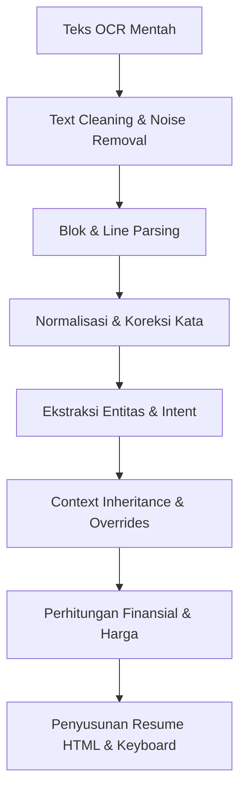

# Alur Lengkap Pemrosesan Data: Dari Foto Nota (OCR) hingga Penyimpanan Transaksi (NLP)

**100% Sesuai dengan Kode Sistem Asli**

---

## 1. Alur Pengiriman & Penerimaan Foto oleh Bot

*File terkait:* [photo_handler.py](file:///c:/Users/FINN/Documents/BOT/handlers/photo_handler.py)

1. **User Kirim Foto**: Pengguna mengirimkan berkas foto nota/transaksi ke bot Telegram.
2. **Handle Photo**: Pesan foto diterima oleh handler `handle_docs_photo()` di [photo_handler.py](file:///c:/Users/FINN/Documents/BOT/handlers/photo_handler.py).
3. **Download File**: Bot mengambil tautan berkas dari Telegram API dan mengunduh berkas gambar tersebut secara lokal dengan nama sementara `temp_photo_<chat_id>.jpg`.

---

## 2. Alur Preprocessing & Transmisi ke Mistral OCR (Pixtral)

*File terkait:* [ocr_service.py](file:///c:/Users/FINN/Documents/BOT/services/ocr_service.py), [ocr_preprocessor.py](file:///c:/Users/FINN/Documents/BOT/services/ocr_preprocessor.py)

### 2.1 Preprocessing & Optimisasi Gambar Lokal
Sebelum dikirim ke API luar, gambar dioptimalkan secara lokal untuk mengurangi beban data dan mempercepat durasi respon API:
1. Gambar dimuat menggunakan library OpenCV (`cv2.imread`).
2. Menghitung dimensi terpanjang dari gambar `max_dim = max(h, w)`.
3. Bila menggunakan engine `mistralocr`, sistem mengambil opsi konfigurasi:
   - `OCR_MISTRAL_MAX_DIM` (default: **1800px**).
   - `OCR_MISTRAL_JPEG_QUALITY` (default: **82**).
   - `OCR_MISTRAL_MAX_SOURCE_BYTES` (default: **1.500.000 byte / 1,5 MB**).
4. Jika dimensi atau ukuran berkas asli melebihi ambang batas, sistem secara proporsional melakukan *resize* dan melakukan *re-encode* berkas gambar menjadi format JPEG dengan kualitas 82% ke dalam berkas sementara.

### 2.2 Pengiriman Request ke API Mistral OCR
1. Berkas gambar dibaca secara biner lalu diubah menjadi format string Base64 (`base64.b64encode`).
2. Disusun dalam format Data URL: `data:<mime_type>;base64,<base64-string>`.
3. Sistem membuat HTTP POST Request ke endpoint resmi Mistral: `https://api.mistral.ai/v1/chat/completions`.
   - **Headers**:
     - `Authorization`: `Bearer <MISTRAL_API_KEY>`
     - `Content-Type`: `application/json`
   - **Payload JSON**:
     ```json
     {
       "model": "pixtral-large-latest",
       "messages": [
         {
           "role": "user",
           "content": [
             {
               "type": "text",
               "text": "Extract all text from this receipt or document. Return only the extracted text, no explanations."
             },
             {
               "type": "image_url",
               "image_url": "data:image/jpeg;base64,<base64-string>"
             }
           ]
         }
       ],
       "temperature": 0,
       "max_tokens": 2048
     }
     ```
   - **Koneksi & Timeout**:
     - Connect Timeout: **30 detik** (`MISTRAL_OCR_CONNECT_TIMEOUT_SECONDS`)
     - Read Timeout: **180 detik** (`MISTRAL_OCR_READ_TIMEOUT_SECONDS`)
     - Batas Percobaan (Max Attempts): **3x percobaan** (`MISTRAL_OCR_MAX_ATTEMPTS`) disertai delay back-off jeda waktu di setiap kegagalan.

### 2.3 Penanganan Output OCR & Caching
1. Respon JSON diterima, teks diekstrak dari `choices[0].message.content`.
2. Hasil teks OCR disimpan ke cache memori `_ocr_result_cache` (OrderedDict) dengan kunci berupa hash SHA1 gambar (TTL default: **3600 detik**, kapasitas: **64 item**).
3. Berkas sementara yang dibuat saat optimisasi dihapus dari penyimpanan lokal.

---

## 3. Penerusan Hasil OCR ke NLP

*File terkait:* [photo_handler.py](file:///c:/Users/FINN/Documents/BOT/handlers/photo_handler.py)

1. Teks hasil OCR disanitasi menggunakan `sanitize_input()` untuk mencegah *escape character* atau simbol merusak.
2. Teks OCR mentah dikirimkan sebagai pesan rangkuman ke pengguna Telegram (dipecah per 3200 karakter).
3. Teks tersebut kemudian dilemparkan ke fungsi parser utama: `_proses_hasil_ocr_ke_nlp(chat_id, msg_nlp.message_id, hasil_akhir)`.

---

## 4. Pemrosesan NLP (Natural Language Processing Pipeline)

*File terkait:* [normalizer.py](file:///c:/Users/FINN/Documents/BOT/nlp/normalizer.py), [processor.py](file:///c:/Users/FINN/Documents/BOT/nlp/processor.py), [extractor.py](file:///c:/Users/FINN/Documents/BOT/nlp/extractor.py)



### 4.1 Text Cleaning & Noise Removal
Sebelum diproses, bot membersihkan elemen-elemen dekoratif UI bot agar tidak mengotori data:
1. **Menghapus Noise UI**: Baris berisi teks menu seperti `"hasil ekstraksi ocr"`, `"lengkapi data"`, dsb. dibuang via regex `_BOT_UI_NOISE_RE`.
2. **Menghapus Emoji Label**: Baris berawalan emoji UI Telegram seperti `📅`, `👤`, `📦` dibersihkan melalui regex `_BOT_UI_LABEL_LINE_RE`.
3. **Normalisasi Karakter Baris**: Menghapus bullet list (`•`, `*`, `~`, `-`), memangkas indeks baris seperti `[1]`, dan membersihkan spasi berlebih menggunakan `_normalize_ocr_line()`.

### 4.2 Blok & Line Parsing (Pemecahan Struktur Kalimat)
Sistem menggunakan logika parsing berbasis blok pada [photo_handler.py](file:///c:/Users/FINN/Documents/BOT/handlers/photo_handler.py) untuk menstrukturkan teks OCR:
1. **Pemisahan Blok Tanggal**: Kalimat dipecah menjadi blok-blok terpisah berdasarkan pola tanggal (`DD-MM-YYYY` atau `DD/MM/YYYY`) menggunakan regex `_DATE_RE` melalui fungsi `_split_ocr_blocks()`.
2. **Ekstraksi Nama Blok**: Mencari nama pelanggan di dalam blok via `_extract_block_name()`.
3. **Ekstraksi Metode Pembayaran Blok**: Mencari metode pembayaran (`Tunai`, `Transfer`, dsb.) via `_extract_block_method()`.
4. **Ekstraksi Baris Barang & Kuantitas**: Setiap baris item dianalisis untuk mendapatkan nama produk, kuantitas angka (`JUMLAH`), dan satuan unit (`SATUAN` seperti *dus, pcs, pack*) dengan regex `_UNIT_RE`.

Hasil akhir tahap ini dikompilasi kembali menjadi format kalimat terstruktur standar NLP:
`"tanggal <DD-MM-YYYY> nama <Nama> <Barang> <Jumlah> <Satuan> belum lunas"`

### 4.3 Normalisasi & Koreksi Kata (`koreksi_teks`)
Kalimat terstruktur kemudian diproses oleh `koreksi_teks()` di [normalizer.py](file:///c:/Users/FINN/Documents/BOT/nlp/normalizer.py):
1. **Pembersihan Akhir Kata**: Angka `0` atau `1` yang menempel di ujung kata dibuang (misal: `prmen1` -> `prmen`).
2. **Lowercase**: Teks diubah ke huruf kecil agar konsisten.
3. **Koreksi Leet-Speak**: Angka `0` diubah ke huruf `o`, angka `1` diubah ke huruf `l` jika berada di tengah kata (misal: `wi110` -> `willo`).
4. **Proteksi Frasa Status**: Mengamankan frasa multi-kata seperti `"belum lunas"` atau `"sudah bayar"` dengan menggantinya ke token sementara `__STATUSPHRASE<idx>__` agar tidak dirusak oleh pencocokan fuzzy.
5. **Kamus Alias (Prioritas Tinggi)**: Menguji setiap kata terhadap `KAMUS_ALIAS`. Jika kata tersebut terdaftar (bukan nama generik), langsung digantikan ke nama produk resmi (misal: `millo` -> `Willo`).
6. **Kamus Typo & Singkatan**: Mengganti kata berdasarkan `NORMALIZATION_DICT` (misal: `tp` -> `tapi`, `tf` -> `transfer`).
7. **Fuzzy Word Matching (RapidFuzz)**: Kalimat dipecah menjadi token unigram dan bigram, lalu dicocokkan dengan `DAFTAR_KATA_KUNCI` + daftar barang resmi menggunakan `rapidfuzz.process.extractOne` dengan pencocokan fuzzy Levenshtein:
   - Bigram Match (kombinasi 2 kata): Threshold **90%** (misal: `beng beng` -> `bembeng`).
   - Unigram Match (1 kata): Threshold **85%** (misal: `willo` -> `Willo`).
8. **Restorasi Frasa Status**: Token sementara `__STATUSPHRASE...__` dikembalikan ke teks aslinya.

### 4.4 Ekstraksi Entitas & Intent
1. **Pola Pembayaran Campuran (Mixed Payment)**: Fungsi `parse_multi_item_with_status()` mendeteksi pola pesanan multi-item dengan status pembayaran yang berbeda di akhir pesan (misal: "pesan A 5 dus, B 10 dus yang sudah lunas A, B belum bayar").
2. **Multi-Entry Splitting**: Jika menggunakan format baris baru atau koma, kalimat dipecah menjadi entri-entri transaksi tunggal menggunakan `split_multi_entries()`.
3. **Regex Entity Extraction**: Setiap entri diekstrak entitasnya oleh `ekstrak_entitas()` di [extractor.py](file:///c:/Users/FINN/Documents/BOT/nlp/extractor.py):
   - **TANGGAL**: Menggunakan regex tanggal absolut/relatif (`hari ini`, `kemarin`, `lusa`, `2 hari lalu`).
   - **NAMA**: Mencari nama dengan gelar (`pak`, `bu`, `mas`) atau nama tanpa gelar dengan mengabaikan kata kunci kamus dan kata operasional.
   - **BARANG & SATUAN**: Pencocokan terhadap katalog master barang dan token satuan unit.
   - **HARGA & TOTAL**: Regex pendeteksi format mata uang dan singkatan numerik (`100k` -> `100000`, `5jt` -> `5000000`).
   - **NOMINAL_BAYAR**: Mengidentifikasi nominal yang disetorkan pengguna dari pola cicilan/DP.
   - **STATUS & METODE**: Mengidentifikasi status bayar (`Lunas`, `Hutang`, `Dicicil`) dan metode pembayaran (`Tunai`, `Transfer`, dsb.).
4. **Context Inheritance & Overrides (`_apply_multi_overrides`)**:
   - Tanggal dan nama diwariskan dari item pertama ke item-item berikutnya dalam batch transaksi yang sama.
   - Mengambil status pembayaran global (seperti kata `"semua lunas"` di akhir baris akan memperbarui seluruh item).
   - Menentukan intent akhir per item menggunakan `tentukan_intent()`.

---

## 5. Perhitungan Finansial & Harga Transaksi

Langkah perhitungan ini diimplementasikan di [photo_handler.py](file:///c:/Users/FINN/Documents/BOT/handlers/photo_handler.py) dan fungsi `apply_batch_financials()` di [ui_transaksi.py](file:///c:/Users/FINN/Documents/BOT/services/ui_transaksi.py):

### 5.1 Lookup Harga Default
- Bila entitas `BARANG` berhasil diekstraksi tetapi `HARGA` per unitnya kosong:
  - Sistem memanggil `cari_harga_default()` untuk mencocokkan barang dengan data master barang di database berdasarkan kecocokan nama produk dan satuan.
  - Jika ditemukan, sistem mengisi `HARGA` unit dan memperbarui `SATUAN` kanonik produk tersebut.

### 5.2 Perhitungan Matematika Transaksi
- **Total Harga Item**: 
  Jika `TOTAL` harga kosong sedangkan `HARGA` dan `JUMLAH` kuantitas terisi, total harga dihitung secara otomatis:
  $$\text{TOTAL} = \text{JUMLAH\_ANGKA} \times \text{HARGA\_SATUAN}$$
  Hasilnya disimpan dalam bentuk format Rupiah (contoh: `150000` -> `"Rp 150.000"`).

### 5.3 Perhitungan Pembayaran & Sisa Tagihan (Hutang)
- **Kasus Pembayaran Batch Global**:
  Jika pengguna melakukan pembayaran nominal sekaligus untuk seluruh nota (batch payment), nominal tersebut didistribusikan secara proporsional ke semua item berdasarkan bobot harga item terhadap total keseluruhan nota.
- **Kasus Pembayaran per Item**:
  - Jika Status = `"Lunas"`, maka:
    $$\text{Nominal Bayar} = \text{Total Harga}$$
  - Jika Status = `"Dicicil"`, maka nominal dihitung dari persentase fraksi cicilan (misal kata kunci `"setengah"` memicu fraksi `0.5`, sehingga nominal bayar = $50\% \times \text{Total Harga}$).
- **Sisa Tagihan (Hutang)**:
  Untuk setiap item, sisa tagihan akhir yang akan dicatat di database dihitung dengan rumus:
  $$\text{Sisa Tagihan (Hutang)} = \text{Total Harga} - \text{Nominal Bayar}$$

---

## 6. Penyusunan Data Transaksi Final

Proses penyusunan tampilan respon chat Telegram diatur oleh [ui_transaksi.py](file:///c:/Users/FINN/Documents/BOT/services/ui_transaksi.py):

### 6.1 Deteksi Kelengkapan Data (Missing Keys)
Sistem memvalidasi keberadaan field wajib berikut sebelum transaksi dapat disimpan:
- `NAMA` (Nama Pelanggan)
- `BARANG` (Nama Produk)
- `JUMLAH` (Kuantitas + Satuan)
- `STATUS` (Status Pembayaran)

Jika ada field wajib yang kosong, sistem memicu alur koreksi data dengan menampilkan pesan peringatan interaktif bertanda tanya (misal `👤 Pelanggan: ? (Masukkan Nama Pelanggan)`).

### 6.2 Penyusunan Resume HTML
Resume transaksi disusun menjadi pesan berformat HTML premium yang sangat mudah dibaca oleh pengguna. Informasi yang ditampilkan meliputi:
- Rincian produk, kuantitas, harga per unit, total harga, jumlah bayar, sisa tagihan, status bayar, dan metode pembayaran.
- Alokasi pembagian nominal cicilan apabila menggunakan pembayaran batch global.

### 6.3 Penyusunan Inline Keyboard (Tombol Interaktif)
Bot menyisipkan tombol interaktif Telegram (`InlineKeyboardMarkup`):
- **Jika data sudah lengkap**:
  - Tombol `✅ Konfirmasi Simpan`: Mengirim callback untuk menyimpan seluruh transaksi ke database (tabel `transaksi` di Supabase).
  - Tombol `✏️ Edit Manual`: Membuka formulir pengeditan data secara manual.
- **Jika data belum lengkap**:
  - Tombol aksi spesifik untuk langsung mengisi kolom yang kosong (misal: tombol `👤 Isi Nama`, `📦 Isi Barang`).

---

## 7. Penyimpanan ke Database (Supabase) & Pembersihan

1. **Simpan ke Supabase**: Setelah pengguna menekan tombol `✅ Konfirmasi Simpan`, data dimasukkan ke tabel `transaksi` Supabase menggunakan `insert_transaksi_db()`.
2. **Catat Pelunasan**: Jika status transaksi adalah `Dicicil`, sisa kekurangan bayar dicatat ke tabel `histori_pelunasan` menggunakan `insert_histori_pelunasan_db()`.
3. **Pembersihan Berkas**: Berkas foto sementara `temp_photo_<chat_id>.jpg` segera dihapus dari server lokal untuk menghemat memori.
